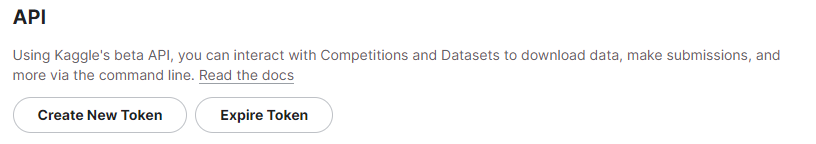

# Submission Dicoding "Belajar Data Analytics dengan Python"


## Project Data Analytics

 Repositori yang berupa projek analis data ,yang dibuat dengan menggunakan **Streamlit** </img>

## Deskripsi

Proyek ini berupa analis data terhadap **Brazilian E-Commerce** yang divisualisasikan secara cloud melalui sebuah website.Tujuan utamanya yakni untuk memberikan insight mengenai informasi data

## Sumber Data
Kaggle Dataset brazilian-ecommerce [(Link Download)](https://www.kaggle.com/datasets/olistbr/brazilian-ecommerce/data)

## Struktur Direktori

- **/dataset**: Merupakan Direktori Projek yang terdiri atas dataset yang berformat .csv
- **/streamlit**: Terdiri atas file main.py yang merupakan kode utama dalam pembuatan visualisasi website
- **ayubsubagiya@gmail.ipynb**: File yang digunakan untuk melakukan analisis data.

## Instalasi

1. Clone repository ke komputer lokal anda menggunakan perintah berikut:

   ```shell
   git clone ....
   ```
2. Lakukan Instalasi Kaggle dan Konfigurasi Kaggle Api:
   dengan cara sebagai berikut :

   https://www.kaggle.com/settings
   Download token kaggle
   
   
   
4. Lakukan Instalasi Library Dengan Perintah Berikut:

   Jalankan semua perintah di **ayubsubagiya@gmail.com.ipynb**


   
